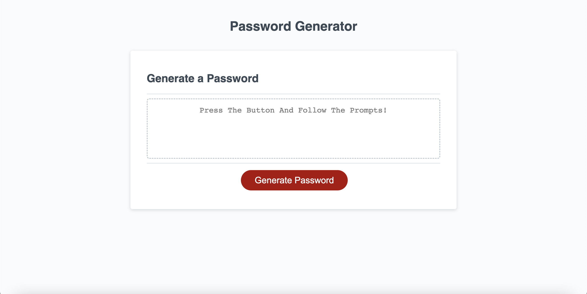

# password-generator
A random password generator powered by JavaScript

## Description

This webpage was created to demonstrate how JavaScript can manipulate HTML elements and add *interactivity* to a webpage. An example of generating a random secure password was used. Using JavaScript, I was able to grab a button element from my HTML file and perform a function when the user clicks that button. Within this function are variable declarations, if else statements, for loops, methods, and mathematical operations. The function was built to send prompts to the user's screen asking for input. The input boxes ask how many characters the user would like in their password and if they'd like to include uppercase, lowercase, number, and/or special character values. Once everything is selected, JavaScript is able to display the output of the function (a new password) as text on the page using a Web API. This was an excellent example of how JavaScript powers a webpage.

During this project, I learned how to apply logic to code and successfully use JavaScript. Every single thing that happens on the page had to be coded. All potential user actions were taken into consideration. It made me break down the process step by step, figuring out whether if else statements, for loops, methods, and/or mathematical operations needed to be used. I also learned how to work with variables, use the prompt() and alert() methods, and how to apply a Web API. Accomplishment was acheived as soon as the webpage began functioning properly and the passwords generated were random and secure based on the users criteria. Ultimately, the project was fun, helped me learned so much about JavaScript, and gave me resuable code for future projects if I ever need to generate random values.

## Usage

Upon clicking the link to the webpage (see "Links" below), the user will be directed a single webpage. Once there, the user will see a password generator with a textarea placeholder and a button. The placeholder tells the user to click the button. Once the button is clicked, answer the oncoming prompts to fill the random password criteria. You are allowed to include uppercase, lowercase, numbers, and symbols. You must choose at least one. You may type "yes" or "no" with upper or lowercase letters. Failure to comply with any prompt results in an alert telling the user to please try again with a correct input option. Hitting the cancel button also results in the program stopping. The user can then restart by pressing the button again. Once a password is generated, the user must highlight the text and press "Copy".

See "Video" below for a demonstration.

## Links

    * https://scottsc0de.github.io/password-generator/

    * https://github.com/ScottsC0de/password-generator

## Video

https://user-images.githubusercontent.com/56902166/193267517-d3b862a7-4d48-4203-bb17-3c50265ad6e7.mov

## Screenshots

